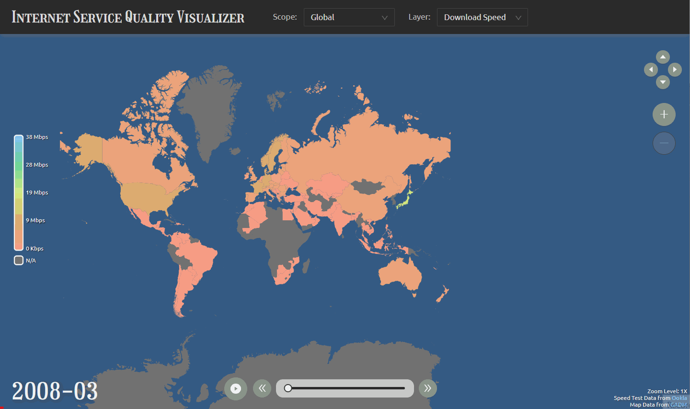

## The Project

### Project Name

Internet Service Quality Visualizer

### Link

https://play.tomzhu.site/cdv-data-story/

### Screenshot

### Description

This project is a visualizer of the global Internet service quality. It visualizes the upload and download speeds for each month between 2008 and 2014 for different countries/regions.

### Datasets

Dataset used in this project:

 - [Ookla Netindex Data on Internet Speed](https://www.kaggle.com/cookiefinder/ookla-netindex-data-on-internet-speed)
  - [GADM World Map Data](https://gadm.org/download_world.html)

Methodology of data processing:

- Simplify the geometry data and reduce the file size using [QGIS](https://qgis.org/en/site/).
- Using [Python](https://www.python.org/), [Jupyter Lab](https://jupyter.org/), and [fuzzywuzzy](https://github.com/seatgeek/fuzzywuzzy) to match the country/region names in datasets, group and merge data entries, and drop unwanted rows and columns to reduce size.

## The Process

### Why did you choose to visualize the data in this way?

I chose to visualize the data with an interactive world map because the data contains multiple metrics and covers a long time period and more than 200 countries. And all the data points are parallel and equally important. It is difficult to demonstrate all the dimensions at the same time in a flattened and static fashion. So, I decided to make it interactive and dynamic, allowing the users to focus on what they are interested.

### What can be seen in the visualization? Does it reveal something you didn't expect?

The users are able to see the exact download speed, upload speed, and number of tests taken on [speedtest.net](https://www.speedtest.net/) for every countries/regions for every month between 2008 and 2014. They are also able to compare between countries and observe the change of Internet service over time. One thing the visualization revealed but I didn't expect is how fast the Internet service quality grew. Before I implemented the visualization, I thought that no tangible increase could be seen from the visualization because 6 years is not a long time period. However, after I finished and played with the visualization, it turned out to be that the Internet service quality grew more than ten times in some countries.

### Did you make crucial compromises? Which ones?

Yes.

- I limited the resolution of the data due to the performance issues. The original datasets I have allow a higher resolution to daily-level and city-wise. Unfortunately, rendering the geometry of all the cities around the world makes the map interaction extremely slow and lagging and loading the huge data requires the users to wait for an unacceptably long time. So, I reduce the resolution to monthly-level and country/region-wise.
- I didn't implement the visualization of Internet outages which I planned to. There are records of Internet outages online. But I still needed to further investigate into the network speed dataset and check if there is corresponding evidential changes in speed test results taken during that time period. Given that the dataset is big, it is really time-consuming to do data processing. Since I didn't have enough time to finish this process, I made this compromise.

### If you had more time, what would you change, improve, add to the project?

- If I had more time, I would increase the resolution of the visualization to demonstrate more details (daily-level, city-wise). It could be done with a use of on-demand lazy load of map tiles (dynamically load map tiles when the users zoom and pan).
- If I had more time, I would add the visualization of Internet outages. It would tell more stories about the network speeds and make the whole project more informative.
- If I had more time, I would have a more careful consideration about the dataset I have. The dataset I have comes from [speedtest.net](https://www.speedtest.net/), which is frequently used for purposes such as speed validation after installing the household broadband or network troubleshooting. It would be great to think about the potential bias within this dataset and how to work with it.